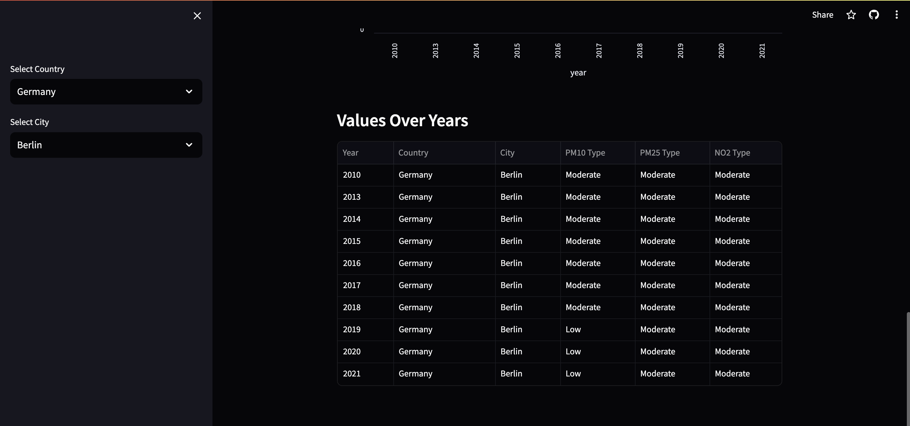

### Dashboard

### Tech Stack

1. Meltano - Extraction and Loading
2. DuckDB - Database
3. Dbt - Data Transformation
4. Streamlit - Visualisation

### Steps to run locally

1. pip install -r requirements.txt
    - This will install all the required dependencies which are necessary to run the project.

2. make build
    - This step will install meltano extractors, loaders & utilities, which are defined in `meltano.yml` file.

3. make pipeline
    - This step will take the file from the `data` folder, and will generate a parquet file from it.
    - After that the required `dbt` dependencies will be installed.
    - Finally, `dbt-duckdb build` command will be run, which will generate all the tables and views from the models folder.

4. make streamlit-visuals
    - Will launch the streamlit app on port 8501

### Meltano's extractors, loaders & utilities

1. `tap-spreadsheets-anywhere` extractor is used to load the local csv file.
2. `target-parquet` loader is used to output the ingested file as a parquet file, with addidional metadata.
3. `dbt-duckdb` utility is used to run the dbt models and load the data into DuckDB tables.